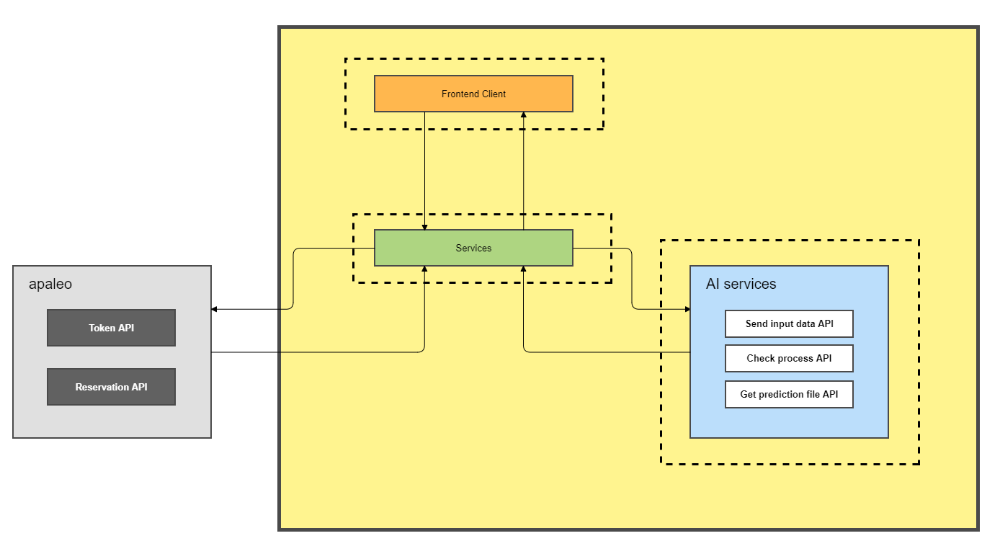
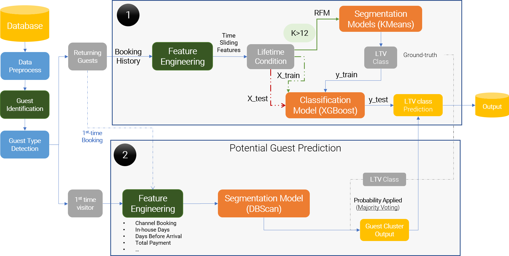

# Description

> #### Using hotel data and AI to predict high value guests and potential VIP guests.
> #### Hotel can leverage on prediction resutls to run more effective email marketing campaign, focus on the right target customers with only limited resources, and deliver better customer experiences.

# Technology stack

## Web/Frontend

- Angular 11
- Graphql
- Lib: amchart, material, foundation

## Server/Backend

- Spring boot 2
- graphql-java 11
- Lib: graphql-java-tool, log4j, POI, commons-io, httpclient

## AI Services

- Python 3.8
- Lib: Pandas, Featuretools, Scikit-learn, Numpy

## Architecture



# AI Pipeline Explanation



# Demo

[Video demo](https://www.loom.com/share/57ff1181758546cd9a4a4a0a4cb7cc0b)

## Deployment

```
docker-compose up --build -d
```

## Contributors

<table>
  <tr>
    <td align="center"><a href="https://github.com/duymrnhtd"><br /><sub><b>Duy Nguyen</b></sub></a><br /></td>
    <td align="center"><a href="https://github.com/hiencm"><br /><sub><b>Hien Cao</b></sub></a><br /></td>
    <td align="center"><a href="https://github.com/quocq6hcm"><br /><sub><b>Quoc Nguyen</b></sub></a><br /></td>
    <td align="center"><a href="https://github.com/HariWu1995"><br /><sub><b>Hai Vo</b></sub></a><br /></td>
    <td align="center"><a href="https://github.com/bigredbug47"><br /><sub><b>Minh Nguyen</b></sub></a><br /></td>
    <td align="center"><a href="https://github.com/hoanganh-nguyen94"><br /><sub><b>Hoang Anh Nguyen</b></sub></a><br /></td>
    </tr>
</table>

[MIT](https://choosealicense.com/licenses/mit/)
